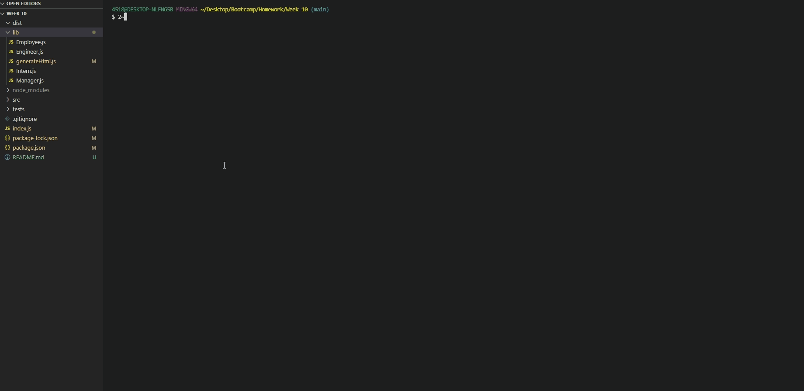

# Week 10 - University of Adelaide Coding Boot Camp

## Object-Oriented Programming: Team Profile Generator

<br/>

## Description

This application was created to generate a team profile based on user command-line input using the Inquirer module from Node.js and displaying the information on a newly created html page with a style sheet. This project also demonstrates use of object oriented programming and test driven development using Jest.

## Installation

You will need to cloen the repository from GitHub, download and install Node.
This app will require some module, you can install them using

```
npm i
```

## Usage

Use your command line to answer questions about your team's info. use this command to start

```
node index.js
```

## Application demo



<br/>
<br/>

## [Watch the demo here (YouTube)](https://youtu.be/uzSlSKPGT-Q)

<br/>

© Carl Santiago\
📧 4518gg@gmail.com
